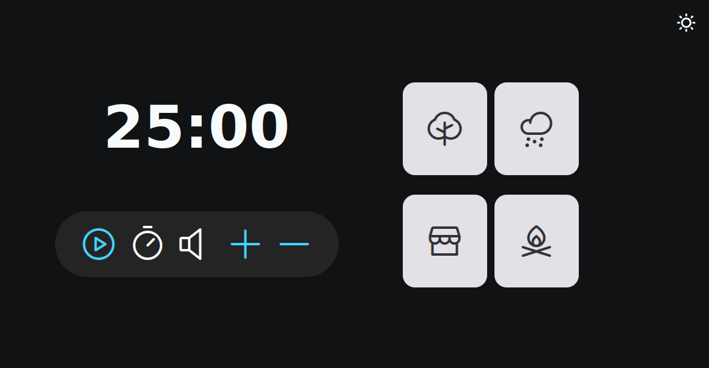

<h1 align="center"> FocusTimer </h1>

<p align="center">
  <a href="#Introducao"> 🧩 Introdução </a>&nbsp;&nbsp;&nbsp;|&nbsp;&nbsp;&nbsp;
  <a href="#Dependencias"> 🧪 Dependências</a>&nbsp;&nbsp;&nbsp;|&nbsp;&nbsp;&nbsp;
  <a href="#Aplicacao"> 🚀 Aplicação</a>&nbsp;&nbsp;&nbsp;|&nbsp;&nbsp;&nbsp;
  <a href="#Licensa"> 📝 License</a>&nbsp;&nbsp;&nbsp;&nbsp;&nbsp;&nbsp;
</p>

<a id="Introducao"></a>
## 🧩 Introdução

### FocusTimer é um Timer desenvolvido em Javascript com possibilidade de alternar entre modo claro/escuro e música de fundo.

<a href="https://www.figma.com/file/t0K56zJ6tjfLZdx9jbsI8g/Focus-Timer-V2-%E2%80%A2-Projeto-Explorer-(Community)?type=design&node-id=0-1&mode=design&t=y7bgVPQ5h4nX0kOf-0">Design no Figma</a>

<div align="center">
  
</div>

### O que foi abordado nesse desafio:

- Como manipular o navegador utilizando a DOM;
- Funções callbacks;
- recursividade;
- Princípios do Clean Code;
- ES6 Modules;
- Padrão Factory;
- Injeção de dependências;
- Refatoração de código.

<a id="Dependencias"></a>
## 🧪 Dependencias
> Requisitos para rotar o código.

- [JavaScript](https://developer.mozilla.org/pt-BR/docs/Web/JavaScript)
- [HTML](https://developer.mozilla.org/pt-BR/docs/Web/HTML)
- [CSS](https://developer.mozilla.org/pt-BR/docs/Web/CSS)

<a id="Aplicacao"></a>
## 🚀 Aplicação

### Instalação e inicialização do projeto

### ```COMANDOS```

#### Para rodar o projeto
```
 Apenas execute o projeto no navegador ou use o live-server
```
<a id="Licensa"></a>
## 📝 License

Este projeto possui uma Licença MIT License - veja o arquivo [LICENSE](./LICENSE) para mais detalhes.

<div align="center">
  Made with ❤️ by Davi Teixeira
</div>
